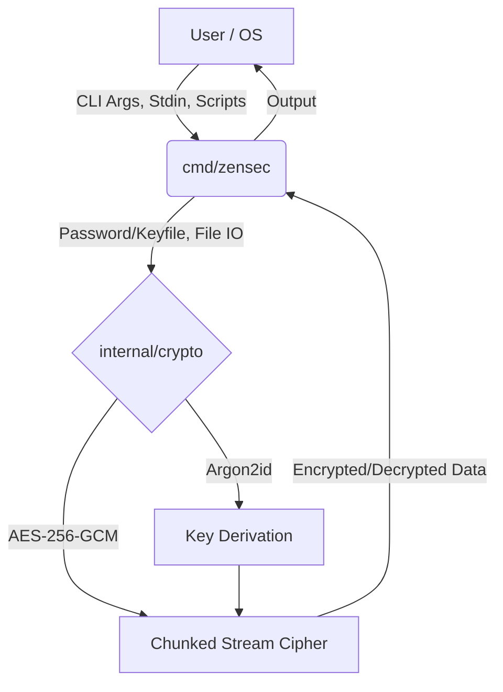

# ZenSec 🔐

[](https://goreportcard.com/report/github.com/githubuser2777/ZenSec)
[](https://golang.org/doc/go1.23)
[](https://opensource.org/licenses/MIT)
[](https://github.com/githubuser2777/ZenSec/actions)

**ZenSec** is a high-performance, strictly secure, and zero-dependency command-line utility built to encrypt and decrypt local files. Written entirely in Go, it adheres to the UNIX philosophy: *do one thing and do it exceptionally well*. 

ZenSec leverages Go's standard cryptography libraries to ensure absolute data privacy and integrity without unnecessary bloat, providing enterprise-grade security for individual users.

---

## 📑 Table of Contents
- [Features](#-features)
- [Architecture](#-architecture)
- [Getting Started](#-getting-started)
- [Usage Guide](#-usage-guide)
- [Security](#-security)
- [Documentation](#-documentation)
- [License](#-license)

---

## ✨ Features

* **Zero-Dependency CLI:** A straightforward Command-Line Interface built entirely with standard libraries. No bloated UI frameworks, no external dependencies to audit.
* **Military-Grade Cryptography:**
  * **AES-256-GCM:** Authenticated streaming encryption prevents data tampering and guarantees confidentiality.
  * **Argon2id:** The PHC-winning key derivation function protects against GPU/ASIC brute forcing.
* **Anti-Tampering Architecture:** 
  * Strict sequence numbers embedded in nonces and AAD (Additional Authenticated Data) mathematically prevent chunk reordering and truncation attacks.
* **Memory Efficient:** Processes massive files (GBs or TBs) using a tiny, constant 64KB memory footprint via chunked stream processing. Your RAM will never overflow.
* **UX & Safety Mechanisms:**
  * Double-prompt password confirmation prevents data loss from typos.
  * Safe file handling with overwrite protection prompts.
* **Advanced Automation & OS Integration:**
  * **Keyfile Support:** Use any physical file (an image, a PDF, a text file) as your cryptographic key.
  * **Cross-Platform Batch Processing:** Native scripts for both Windows (`.bat`) and macOS/Linux (`.sh`) to instantly process hundreds of files.
  * **Windows Context Menu:** Right-click -> "Encrypt with ZenSec" via registry integration.

---

## 🏗 Architecture

ZenSec strictly separates its cryptographic core from the user interface and OS integration layers.



---

## 🚀 Getting Started

### Prerequisites
* [Go 1.23+](https://go.dev/doc/install) (if building from source)

### Installation

Clone the repository and build the standalone binary:

```bash
git clone https://github.com/githubuser2777/ZenSec.git
cd ZenSec

# Download required modules
go mod tidy

# Build the executable
go build -o zensec.exe cmd/zensec/main.go
```

> **Pro-Tip:** Move `zensec.exe` to a folder in your system's `PATH` (e.g., `C:\Windows\System32` on Windows or `/usr/local/bin` on Linux) so you can run it from anywhere.

---

## 🛠️ Usage Guide

### 1. Standard Encryption & Decryption (Password)

Encrypt a file:
```bash
zensec -encrypt -file my_secret.txt
```
*(You will be securely prompted to type and confirm your password)*

Decrypt a file:
```bash
zensec -decrypt -file my_secret.txt.enc
```

### 2. Keyfile Mode (Passwordless)

Instead of a password, you can use any file as your key. This is incredibly useful for automation or storing your "key" on an external USB drive.

```bash
# Encrypt using an image as the key
zensec -encrypt -file backup.zip -keyfile D:\my_secret_key.jpg

# Decrypt using the same image
zensec -decrypt -file backup.zip.enc -keyfile D:\my_secret_key.jpg
```

### 3. Batch Processing (Directories)

Need to encrypt an entire folder? Use the included native scripts. They will prompt you for the folder path, your keyfile, and automatically process every file inside.

* **Windows:** Double-click `batch_zensec.bat`
* **macOS/Linux:** Run `./batch_zensec.sh`

### 4. Windows Context Menu (Right-Click)

1. Ensure `zensec.exe` is in your system `PATH`.
2. Double-click the included `install_context_menu.reg` file.
3. You can now right-click any file in Windows Explorer and select **"Encrypt with ZenSec"** or **"Decrypt with ZenSec"**.

---

## 🔒 Security

ZenSec takes a paranoid approach to security:
- **No Hardcoded Secrets:** Salts and Nonces are dynamically generated using `crypto/rand`.
- **Chunk Integrity:** Every 64KB chunk is individually authenticated. The chunk sequence number is embedded into the GCM nonce and AAD.
- **Truncation Prevention:** The final chunk is explicitly marked in the AAD to prevent an attacker from dropping chunks at the end of the file.
- **Secure Password Entry:** Passwords are read directly from the OS terminal descriptor without echoing to the screen, preventing shoulder surfing and shell history leaks.

---

## 📚 Documentation

For an in-depth look at the internal architecture, please refer to our documentation files:
* [Features Detail](features.md) - Deep dive into technical capabilities.
* [Security Overview](security.md) - Cryptographic design and threat modeling.
* [Project Overview](docs/overview.md) - Philosophy and structural architecture.
* [Roadmap](Roadmap.md) - Project history and status.

---

## 📄 License

This project is licensed under the [MIT License](LICENSE).
